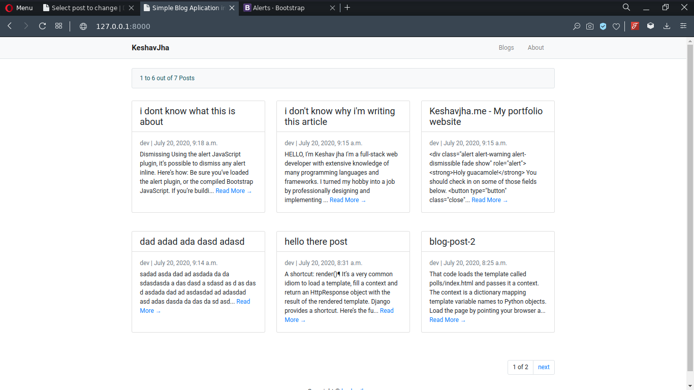
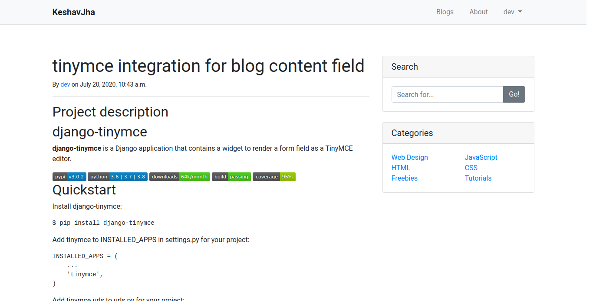
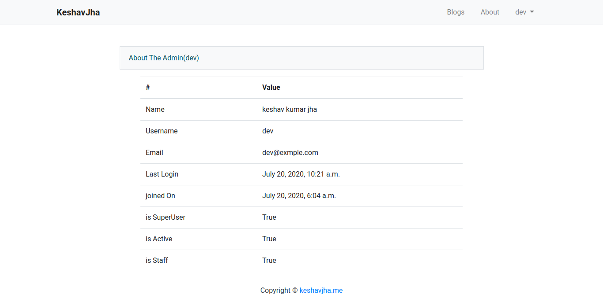

# Simple blog application in django, sqllite3 and bootstrap

## Why
I have created this project to enhance my web development skills. In this project, I used Django, django-tinymce and bootstrap. It's a simple application, just took couple of hours to develop and really improve my basic knowledge of django.

## Deployment Link
NOT DEPLOYED.

## Things i learned
    1. How to create models in django
    2. How to use Pagination in generic module
    3. How to integrate tinymce with django admin panel
    4. explore user object in template file

### How to run
    1) clone
    2) open terminal in same folder
    3) install tinymce( by typing : pip install django-tinymce )
    4) type : python3 manage.py runserver (linux)
    5) hit enter, and browser https://127.0.0.1:8000
    6) To use admin pagel go to https://127.0.0.1:8000/admin (username: dev, password:dev)

## Snapshots

**Blogs**

**Post**

**About**

## list of technologies

* HTML
* BOOTSTRAP
* JavaScript (vanila)
* DJANGO
* PYTHON
